# 清晰架构

[原文](https://herbertograca.com/2017/11/16/explicit-architecture-01-ddd-hexagonal-onion-clean-cqrs-how-i-put-it-all-together/)

### 系统的基本构建块

* **user interface**，运行用户界面
* **application core**，用户界面要使用这个构建块达成目的
* **Infrastructure**，将应用核心和诸如数据库、搜索引擎或第三方 API 这样的工具连接起来。

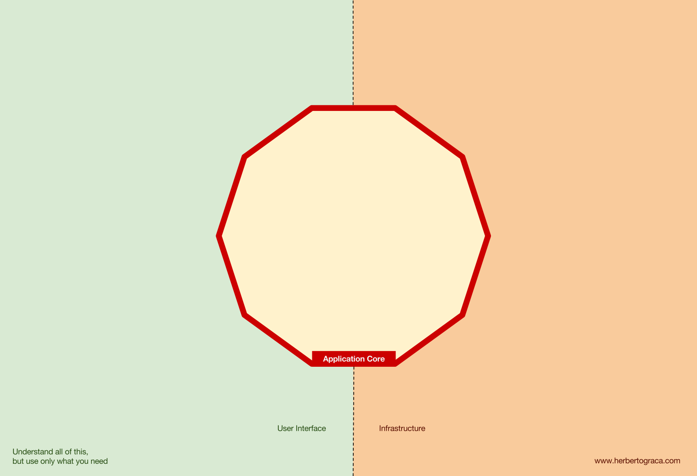

我们真正关心的应该是应用核心。这部分代码才是我们编写代码的目的，它们才是我们的应用。它们可能使用一些不同的用户界面(渐进式 Web 应用，移动应用、命令行、接口...)，但完成实际工作的代码是一模一样的，它们就在应用核心内部，它们不用关心是哪种用户界面触发了它们。

你可以想像得到，典型的应用控制流开始于用户界面中的代码，经过应用核心到达基础设施代码，又返回应用核心，最后将响应传达给用户界面。


***

### 工具

在远离我们系统中最重要的代码-——应用核心-——的地方，还有一些应用会用到的工具，例如数据库引擎、搜索引擎、Web 服务器或者命令行控制台(虽然最后两种工具也是传达机制)。

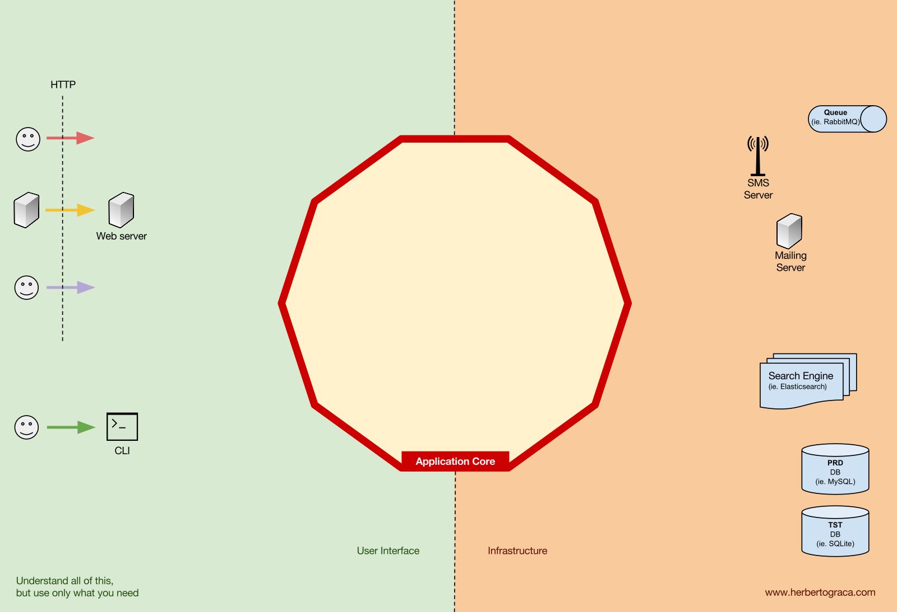

把命令行控制台和数据库引擎放在同一个“篮子”中感觉有点奇怪，尽管它们有着不用的用途，但它们实际都是应用使用的工具。关键的区别在于，命令行控制台和 Web 服务器***告诉我们*****的应用它要做什么**，而数据库引擎是**由我们的应用来告诉它做什么**。这是针锋相对的差别，强烈地暗示着我们应该如何构建连接这些工具和应用核心的代码。

***

### 适配器

连接工具和应用核心的代码单元被称为适配器([端口和适配器架构](https://www.jianshu.com/p/f39f4537857e))。适配器有效地实现了让业务逻辑和特定工具之间可以相互通信的代码。

**告知我们**的应用应该做什么的适配器被称为**主适配器**或**主动适配器**，而那些由我们的应用**告知它**该做什么的适配器被称为**从适配器**或者**被动适配器**。

***

### 端口

而这些适配器并非是随意创建的。它们需要按照应用核心某个特定的入口的要求来创建，即**端口**。端口无外乎是一份工具如何使用应用核心或者如何被应用核心使用的**说明书**。这份说明书，即端口，在大多数语言里最简单的形式就是接口，但实际上也可能由多个接口和 DTO 组成。

**端口(接口)位于业务逻辑内部**，而适配器位于其外部，这一点要特别注意。要让这种模式按照设想发挥作用，端口按照应用核心的需要来设计而不是简单地套用工具的 API，这一点再怎么强调都不为过。

***

### 主适配器

**主适配器**或**主动适配器*****包装*****端口**并通过它告知应用核心应该做什么。**它们将来自传达机制的信息转换成对应用核心的方法调用**。


换句话说，我们的主动适配器就是 Controller 或者控制台命令，它们需要的接口(端口)由其他类实现，这些类的对象通过构造方法注入到 Controller 或者控制台命令。

再举一个更具体的例子，端口就是 Controller 需要的 Service 接口或者 Repository 接口。Service、Repository 或 Query 的具体实现被注入到 Controller 供 Controller 使用。

此外，端口还可以是命令总线接口或者查询总线接口。这种情况下，命令总线或者查询总线的具体实现将被注入到 Controller 中， Controller 将创建命令或查询并传递给相应的总线。

***

### 从适配器

和主动适配器包装端口不同，**被动适配器*****实现*****一个端口(接口)**并被注入到需要这个端口的应用核心里。

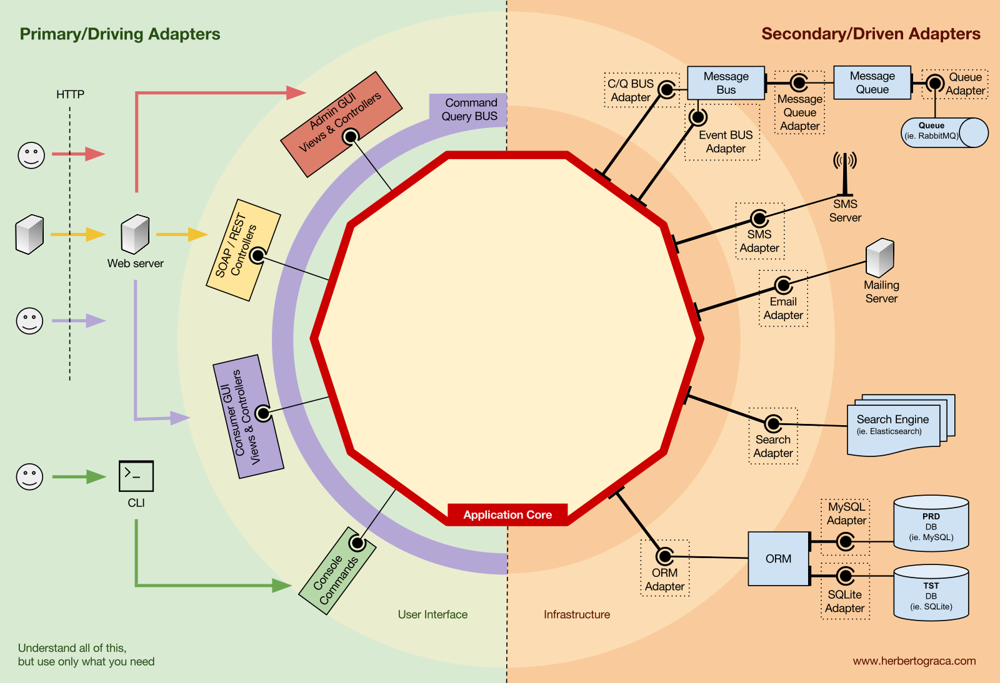

举个例子，假设有一个需要存储数据的简单应用。我们创建了一个符合应用要求的持久化接口，这个接口有一个*保存*数据数组的方法和一个根据 ID 从表中*删除*一行的方法。接口创建好之后，无论何时应用需要保存或删除数据，都应该使用实现了这个持久化接口的对象，而这个对象是通过构造方法注入的。

现在我们创建了一个专门针对 MySQL 实现了该接口的适配器。它拥有保存数组和删除表中一行数据的方法，然后在需要使用持久化接口的地方注入它。

如果未来我们决定更换数据库供应商，比如换成 PostgreSQL 或者 MongoDB，我们只用创建一个专门针对 PostgreSQL 实现了该接口的适配器，在注入时用新适配器代替旧适配器。

***

### 控制反转

这种模式有一个特征值得留意，适配器依赖特定的工具和特定的端口(它需要提供接口的特定实现)。但业务逻辑只依赖按照它的需求设计的端口(接口)，它并不依赖特定的适配器或工具。

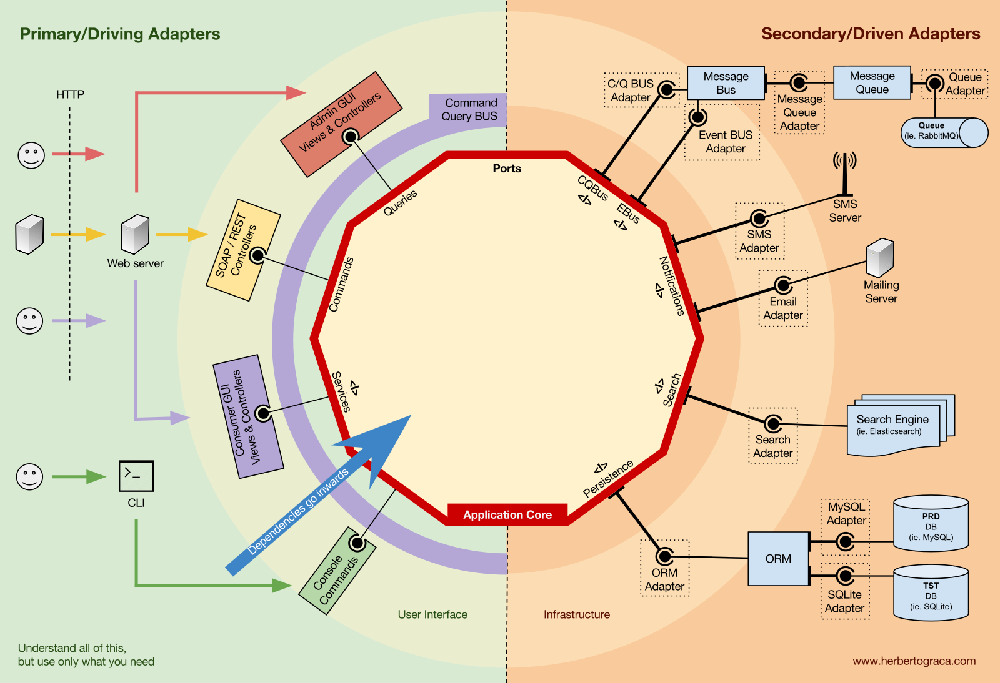

这意味着依赖的方向是由外向内的，这就是**架构层面的控制反转原则**。

再一次强调，**端口按照应用核心的需要来设计而不是简单地套用工具的 API**。

***

### 组织应用核心的结构

在应用中，由一个或多个用户界面触发的应用核心中的过程就是use case。例如，在一个 CMS 系统中，我们可以提供普通用户使用的应用 UI、CMS 管理员使用的独立的 UI、命令行 UI 以及 Web API。这些 UI(应用)可以触发的用例可能是专门为它设计的，也可以是多个 UI 复用的。

Use case定义在应用层中，这是 DDD 提供的第一个被[洋葱架构](https://www.jianshu.com/p/d87d5389c92a)使用的层。


这个层包括了作为一等公民的应用服务(以及它们的接口)，也包括了[端口与适配器架构](https://www.jianshu.com/p/f39f4537857e)中的接口，例如 ORM 接口、搜索引擎接口、消息接口等等。如果我们使用了命令总线和/或查询总线，命令和查询分别对应的处理程序也属于这一层。

应用服务和/或命令处理程序包含了展现一个用例，一个业务过程的逻辑。通常，它们的作用是：

1. 使用 Repostitory 查找一个或多个实体；
2. 让这些实体执行一些领域逻辑；
3. 再次使用 Repostitory 让这些实体持久化，有效地保存数据变化。

命令处理程序有两种不同使用方式：

1. 它们可以包含执行用例的实际逻辑；
2. 它们可以仅仅作为我们应用中的连接片段，接收命令然后简单地触发应用服务中的逻辑。

使用哪种方式是由上下文决定的，例如：

- 我们已经有了合适的应用服务，现在要做的是添加命令总线？
- 命令总线允许指定任意类/方法作为处理程序吗？还是说它们需要扩展已有的类或者实现已有的接口？

应用层还包括**应用事件**的触发，这也代表着某些用例的产出。这些事件触发的逻辑是用例的副作用，比如发送邮件、通知第三方 PAI、发送推送通知，或是发起属于其他应用组件的另一个用例。

***

### 领域层

继续向内一层就是领域层。这一层中的对象包含了数据和操作数据的逻辑，它们只和领域本身有关，独立于调用这些逻辑的业务过程。它们完全独立，对应用层完全无感知。


#### 领域服务

如前所述，应用服务的作用是：

1. 使用 Repostitory 查找一个或多个实体；
2. 让这些实体执行一些领域逻辑；
3. 再次使用 Repostitory 让这些实体持久化，有效地保存数据变化。

然而，有时我们还会碰到某种领域逻辑，它涉及不同的实体。这些实体也许是同一个类型，也许不是，而且我们觉得这种领域逻辑并不属于这些实体，这种逻辑不是这些实体的直接责任。

所以，我们的第一反应也许是把这些逻辑放到实体外的应用服务中。然而，这意味着这些领域逻辑就不能被其它的用例复用。领域逻辑应该放在应用层之外！

解决方法是创建领域服务，它的作用是接收一组实体并对它们执行某种业务逻辑。领域服务属于领域层，因此它并不了解应用层中的类，比如应用服务或者 Repository[译注：Repository 属于应用服务层？？]。另一方面，它可以使用其他领域服务，当然还可以使用领域模型对象。

#### 领域模型

在架构的正中心，是完全不依赖外部任何层次的领域模型。它包含了那些表示领域中某个概念的业务对象。这些对象的例子首先就是实体，还有值对象、枚举以及其它领域模型种用到的任何对象。

领域事件也“活在”领域模型中。当一组特定的数据发生变化时就会触发这些事件，而这些事件会携带这些变化的信息。换句话说，当实体变化时，就会触发一个领域事件，它携带着发生变化的属性的新值。这些事件可以完美地应用于事件溯源。

***

### 组件

目前为止，我们都是使用层次来划分代码，但这是细粒度的代码隔离。根据 Robert C. Martin 在[尖叫架构](https://8thlight.com/blog/uncle-bob/2011/09/30/Screaming-Architecture.html)中表达的观点，按照子域和[限界上下文](http://ddd.fed.wiki.org/view/welcome-visitors/view/domain-driven-design/view/bounded-context)对代码进行划分这种粗粒度的代码隔离同样重要。这通常被叫做“*按特性分包*”或者“*按组件分包*”，和“*按层次分包*”相呼应。Simon Brown 的文章“[Package by component and architecturally-aligned testing](http://www.codingthearchitecture.com/2015/03/08/package_by_component_and_architecturally_aligned_testing.html)”很好地阐述了这种划分：

我是“*按组件分包*”方式的坚定拥护者，在此我厚着脸皮将 Simon Brown *按组件分包*的示意图做了如下修改：

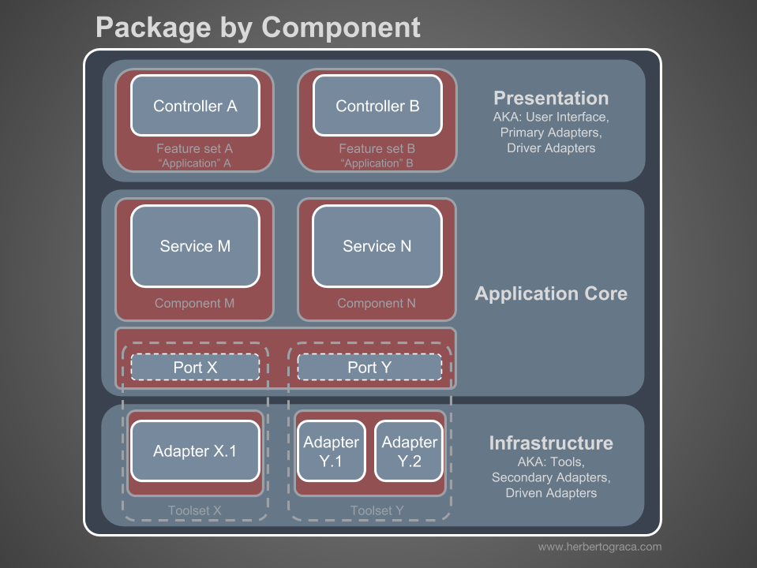

这些代码块在前面描述的分层基础上再进行了“横切”，它们是应用的[组件](https://herbertograca.com/2017/07/05/software-architecture-premises/)([译](https://www.jianshu.com/p/df295f92fb52))。组件的例子包括~~认证~~、~~授权~~、账单、用户、评论或帐号，而它们总是都和领域相关。像认证和/或授权这样的限界上下文应该被看作外部工具，我们应该为它们创建适配器，把它们隐藏在某个端口之后。


#### 组件解耦

和细粒度的代码单元(类、接口、特质、混合等等)一样，粗粒度的代码单元(组件)也会从高内聚低耦合中受益。

我们使用了依赖注入，**通过将依赖注入类而不是在类内部初始化依赖**；以及依赖倒置；**让类依赖抽象(接口和/或抽象类)而不是具体类**来解耦类。这意味着类不用知道它要使用的具体类的任何信息，不用引用所依赖的类的完全限定类名。

以同样的方式完全解耦的组件意味着组件不会直接了解其它任何组件的信息。换句话说，它不会引用任何来自其它组件的细粒度的代码单元，甚至都不会引用接口！这意味着依赖注入和依赖倒置对组件解耦是不够用的，我们还需要一些架构层级的结构。我们需要事件、共享内核、最终一致性甚至发现服务！

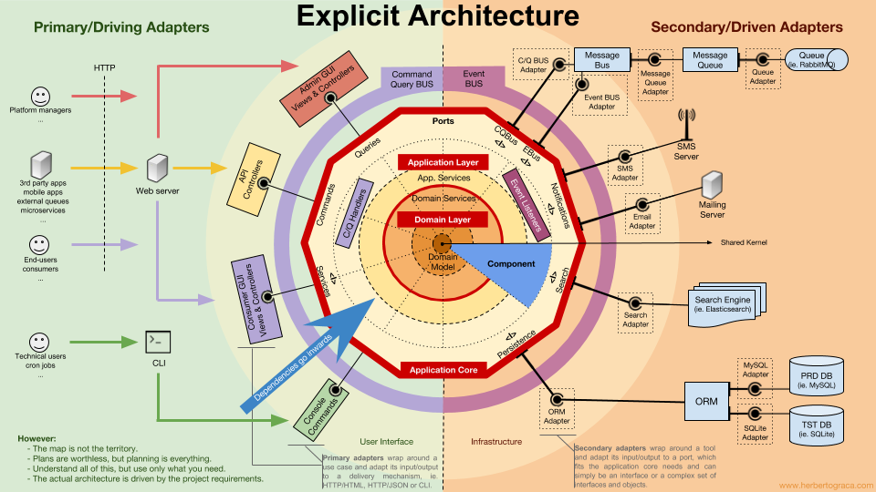

#### 触发其他组件的逻辑

当一个组件(组件 A)中有事情发生需要另一个组件(组件B)做些什么时，我们不能简单地从组件 A 直接调用组件 B 中的类/方法，因为这样 A 就和 B 耦合在一起了。

但是我们可以让 A 使用事件派发器，派发一个领域事件，这个事件将会投递给任何监听它的组件，例如 B，然后 B 的事件监听器会触发期望的操作。这意味着组件 A 将依赖事件派发器，但和 B 解耦了。

然而，如果事件本身“活在” A 中，这将意味着 B 知道了 A 的存在，就和 A 存在耦合。要去掉这个依赖，我们可以创建一个包含应用核心功能的库，由所有组件共享，这就是[共享内核](http://ddd.fed.wiki.org/view/welcome-visitors/view/domain-driven-design/view/shared-kernel)。这意味着两个组件都依赖共享内核，而它们之间却没有耦合。共享内核包含了应用事件和领域事件这样的功能，而且还包含规格对象，以及其它任何有理由共享的东西。记住共享内核的范围应该尽可能的小，因为它的任何变化都会影响所有应用组件。而且，如果我们的系统是语言异构的，比如使用不同语言编写的微服务生态，共享内核需要做到与语言无关的，这样它才能被所有组件理解，无论它们是用哪种语言编写的。例如，共享内核应该包含像 JSON 这样无关语言的事件描述(例如，名称、属性，也许还有方法，尽管它们对规格对象来说更有意义)而不是事件类，这样所有组件/微服务都可以解析它，还可以自动生成各自的具体实现。

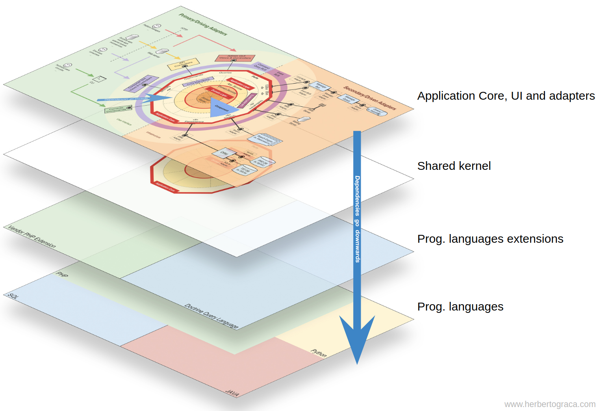

这种方法既适用于单体应用，也适用于像微服务生态系统这样的分布式应用。然而，这种方法只适用于事件异步投递的情况，在需要即时完成触发其它组件逻辑的上下文中并不适用！组件 A 将需要向组件 B 发起直接的 HTTP 调用。这种情况下，要解耦组件，我们需要一个发现服务，A 可以询问它得知请求应该发送到哪里才能触发期望的操作，又或是向发现服务发起请求并由发现服务将请求代理给相关服务并最终返回响应给请求方。这种方法会把组件和发现服务耦合在一起，但会让组件之间解耦。

#### 从其他组件获取数据

我的看法是，组件不允许修改不“属于”它的数据，但可以查询和使用任何数据。

**组件之间共享的存储数据**

当一个组件需要使用属于其它组件的数据时，比如说账单组件需要使用属于账户组件的客户名字，账单组件会包含一个查询对象，可以在数据存储中查询该数据。简单的说就是账单组件知道任何数据集，但它只能通过查询只读地使用不“属于”它的数据。

**按组件隔离数据的存储数据**

这种情况下，这种模式同样有效，但数据存储层面的复杂度更高。

组件拥有各自的数据存储意味着每个数据存储都包含：

- 一组属于它的数据，并且只允许它自己修改这些数据，让它成为单一事实来源；
- 一组其它组件数据的副本，它自己不能修改这些数据，但组件的功能需要这些数据，而且一旦数据在其所属的组件中发生了变化，这些副本需要更新。

每个组件都会创建其所需的其它组件数据的本地副本，在必要时使用。当数据在其所属的组件中发生了变化，该组件将触发一个携带数据变更的领域事件。拥有这些数据副本的组件将监听这个领域事件并相应地更新它们的本地副本。

***

### 控制流

如前所述，控制流显然从用户出发，进入应用核心，抵达基础设施工具，再返回应用核心并最终返回给用户。但这些类到底是是如何配合的？哪些类依赖哪些类？我们怎样把它们组合在一起？

根据 Uncle Bob 在他关于整洁架构的文章中的说法，我来试着用 UML 图解释控制流...

#### 没有命令/查询总线

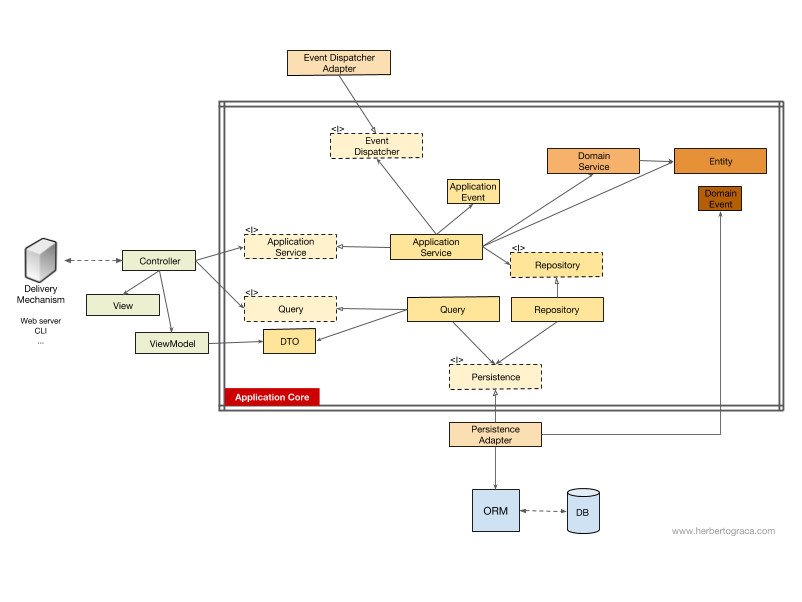

上图中我们使用了应用服务接口，尽管我们会质疑这并没有必要。因为应用服务是我们应用代码的一部分，而且我们不会想用另外一种实现来替换它，尽管我们可能会彻底地重构它。

查询对象包含优化过的查询，简单地返回一些给用户看的原始数据就好。这些数据将放在 DTO 中返回，并注入到 ViewModel。ViewModel 中可能有一些 View 逻辑，它被用来填充 View。

另一方面，应用服务还包含用例逻辑，不是浏览数据这么简单，我们需要在系统中做一些事情时触发这些逻辑。应用服务依赖 Repository 返回实体，这些实体中包含着需要触发的逻辑。它也可能依赖领域服务来整合多个实体来完成领域流程，但这种情况很少出现。

展开用例之后，应用服务可能想通知整个系统，这个用例已经发生了。这种情况下，它还要依赖事件派发器来触发事件。

很有意思的是我们在持久化引擎和资源库之上都放上了接口。尽管看起来有些多余，但它们服务于不用的目标：

- 持久化接口是 ORM 之上的抽象层，这样我们可以切换使用的 ORM 而不用修改应用核心。
- 资源库接口是持久化引擎自身的抽象。比方说我们想要从 MySQL 切换为 MongoDB。如果我们想继续使用同样的 ORM，持久化接口可以保持不变，甚至持久化适配器也可以保持不变。然而，两者的查询语言完全不同，所以，我们可以创建使用同样持久化机制的新资源库，可以实现相同的资源库接口，但使用 MongoDB 查询语言而不是 SQL 来构建查询。

#### 有命令/查询总线

如果我们的应用使用了命令/查询总线，UML 图基本没有变化，唯一的区别是控制器现在会依赖总线、命令或查询。它将实例化命令或查询，将它们传递给总线。总线会找到合适的处理程序接收并处理命令。

在下图中，命令处理程序接下来将使用应用服务。然而，这不总是必须的，实际上大多数情况下，处理程序将包含用例的所有逻辑。只有在其它处理程序需要重用同样的逻辑时，我们才需要把处理程序中的逻辑提取出来放到单独的应用服务中。

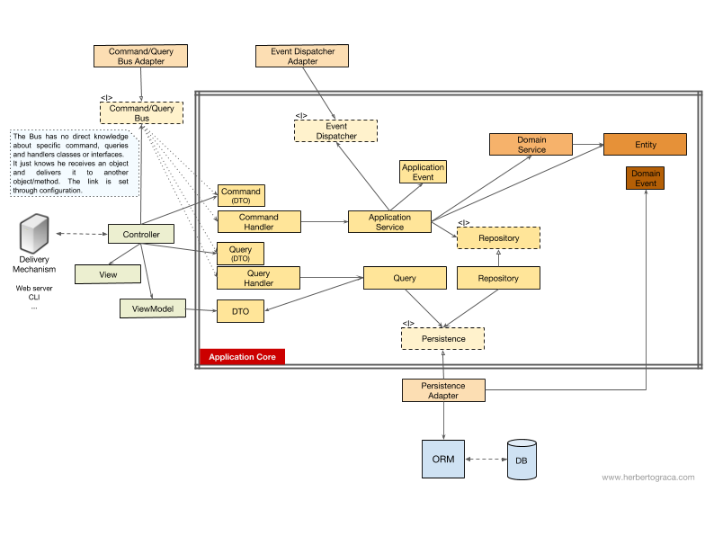

你可能注意到了，总线和命令查询，以及处理程序之间没有依赖。这是因为实际上它们之间应该互相无感知，才能提供足够的解耦。只有通过配置才能设置总线可以发现哪些命令，或者查询应该由哪个处理程序处理。

如你所见，两种情况下，所有跨越应用核心边界的箭头——依赖——都指向内部。如前所述，这是端口和适配器架构、洋葱架构以及整洁架构的基本规则。

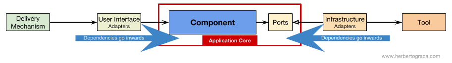

***

一如既往，这些架构的目标是得到高内聚低耦合的代码库，这样变化才会简单、快速和安全。

> 计划不名一文，但制订计划的过程至关重要。——艾森豪威尔

这份信息图是一份概念地图。了解并理解所有这些概念将帮助我们规划出健康的架构和应用。

不过：

> 地图并非疆域。——阿尔弗雷德·柯日布斯基

这只是一份指南！**应用才是你的疆域，现实情况和具体用例才是运用这些知识的地方，它们才能勾勒出实际架构的轮廓！**

**我们需要理解所有这些模式，但我们还时常需要思考和理解我们的应用需要什么，我们应该在追求解耦和内聚的道路上走多远。**这个决定可能受到许多因素的影响，包括项目的功能需求，也包括构建应用的时间期限，应用寿命，开发团队的体验等等因素。

就到这里，这是我对一切的理解。这就是我脑海中对这一切的梳理。

***

## 实现

[原文1](https://herbertograca.com/2018/07/07/more-than-concentric-layers/)

[原文2](https://herbertograca.com/2019/06/05/reflecting-architecture-and-domain-in-code/)

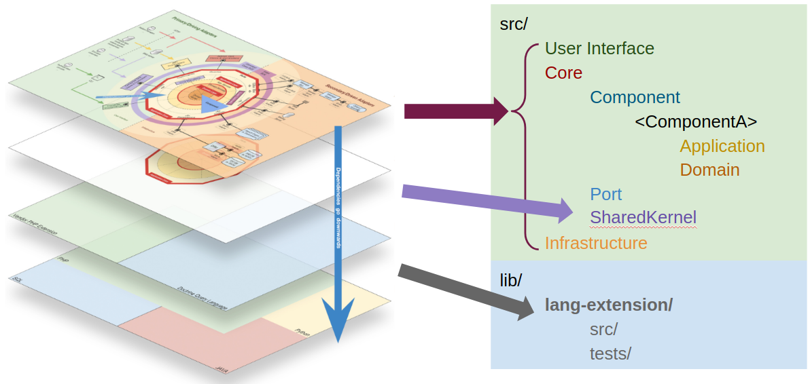

```
/src
	/user_interface
		/API
			/Rest
				<component1>
			/GraphQl
		/Console
			<component1>
			<component2>
		/Website
			/Admin
				<component1>
			/Consumer
	
	/core
		/Component
			/Blog
				/Application
				/Domain
		/Shared_Kernel
		/Port
	/infrastructure
		/commandBus
    /EventBus
    /Search
    /Persistence
```

