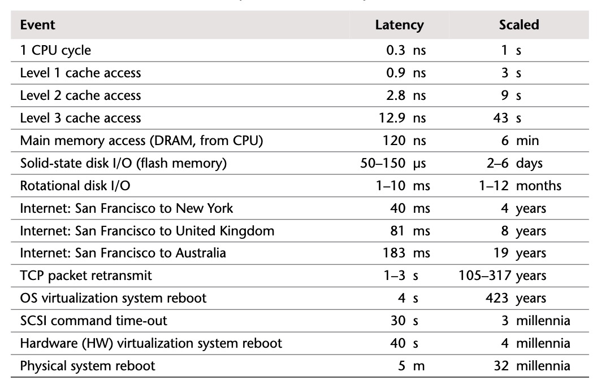
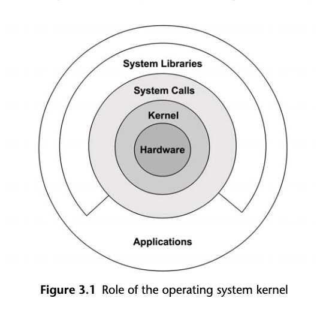

# 性能之巅

***

### 事件

1. 设置性能目标和建立性能模型
2. 基于软硬件原型进行性能特征归纳
3. 对开发代码进行性能分析（软件整合之前）
4. 执行软件非回归性测试（软件发布前或发布后）
5. 针对软件发布版本的基准测试
6. 目标环境中的概念验证测试
7. 生产环境部署的配置优化
8. 监控生产环境中运行的软件
9. 特定问题的性能分析

***

### 视角

性能需要进行多视角分析，图中包括负载分析和资源分析

***

## 方法

### 术语

* **IOPS**： 每秒发生的输入/输出操作的次数，是数据传输的一个度量方法。
* **吞吐量(Throughput)**：工作执行的速率，在数据传输中，用于描述数据传输的数独(bytes/s或者bits/s)，在数据库中，则表示操作的速度(操作数/秒或者事务数/秒)
* **响应时间**：一次操作完成的时间。包含用于等待和服务的时间，也包括用来返回结果的时间
* **延时**：描述操作里用来等待服务的时间。在某些情况下，它可以指的是整个操作时间，等同于响应时间。
* **使用率**：对于服务所请求的资源，使用率描述在所给定的时间区间内资源的繁忙程度。对于存储资源，指的是所消耗的存储容量
* **饱和度**：指的是某一个资源无法满足服务的排队工作量
* **瓶颈**：在系统性能里，瓶颈指的是限制系统性能的那个资源。
* **工作负载**：系统的输入或者对系统所施加的负载叫做工作负载。对于数据库来说，工作负载就是客户端发出的数据库请求和命令。
* **缓存**：用于复制或者缓冲一定量数据的高速存储区域

***

## 系统性能概念

### 时延

**时间量级**

**Latency Number:**

| Event                                         | Latency    |
| --------------------------------------------- | ---------- |
| L1 cache reference                            | 1ns        |
| Branch mispredict                             | 3ns        |
| L2 cache reference                            | 4ns        |
| Mutex lock/unlock                             | 16ns       |
| Main memory reference                         | 100ns      |
| Compress 1KB with Snappy                      | 2us        |
| Send 2,000 bytes over commodity network       | 31ns       |
| SSD random read                               | 16us       |
| Read 1,000,000 bytes sequentially from memory | 2.355us    |
| Round trip in same datacenter                 | 500us      |
| Read 1,000,000 bytes sequentially from SSD    | 38.876us   |
| Disk seek                                     | 2.332582ms |
| Read 1,000,000 bytes sequentially from disk   | 717.936us  |
| Packet roundtrip CA to Netherlands            | 150ms      |
|                                               |            |

***

### 权衡与调整

去权衡相伴的通常是可调参数。

性能调整发生在越高进工作执行的地方效果越显著。

***

### 指标

性能指标是由系统、应用程序或者其他工具产生的度量感兴趣活动的统计数据。性能指标用于性能分析和监控，由命令行提供数据或者由可视化工具提供图表。

常见系统性能指标：

* IOPS
* 吞吐量
* 使用率
* 延时

**开销**

性能指标不是免费的，在某些时候，会消耗CPU周期来收集和保存指标信息。

**问题**

指标可能会是混淆的、复杂的、不可靠的、不精确的，甚至是错误的。

***

### 资源分析

资源分析以对系统资源的分析为起点，涉及的系统资源有：CPU、内存、磁盘、网卡、总线以及直接的互联。

* 性能问题研究，看是否某特定类型资源的责任。
* 容量规划，为设计新系统提供信息，或者对系统资源何时会耗尽做预测。

相关指标：

* IOPS
* 吞吐量
* 使用率
* 饱和度

***

### 工作负载分析

工作负载分析检查应用程序的性能：所施加的工作负载和应用程序是如何响应的。

分析对象：

* 请求，所施加的工作负载
* 延时：应用程序的响应时间
* 完成度：查找错误

相关指标：

* 吞吐量
* 延时

***

### USE方法

USE方法(utilization、saturation、errors)应用于性能研究，对所有的资源，查看它的使用率、饱和度和错误。

* 资源：所有物理资源和部分软件资源
* 使用率：在规定时间间隔内，资源用于服务工作的时间百分比。
* 饱和度：资源不能再服务更多额外工作的程度，通常有等待队列。
* 错误：错误事件的个数。

物理资源列表：

* CPU
* 内存
* 网络接口
* 存储设备
* 控制器
* 互联：CPU、内存、I/O

软件资源列表：

* 互斥锁：锁被持有的时间是使用时间，饱和度指的有线程排队在等锁
* 线程池：线程忙于处理工作的时间是使用时间，饱和度指的是等待线程池服务的请求数目
* 进程/线程容量：系统的进程或线程的总数是有上限的，当前的使用数目是使用率，等待分配任务是饱和度，错误是分配失败
* 文件描述符容量：同进程/线程容量一样，只不过针对的是文件描述符

**使用建议**

* 使用率：100%的使用率通常是瓶颈的信号。使用率超过60%可能会是问题。
* 饱和度：任何程度的饱和度都是问题
* 错误：错误都是值得研究的

***

### 建模

* 可视化识别
* Amdahl扩展定律
* 通用扩展定律
* 排队理论

***

### 容量规划

**资源极限**

该方法研究在负载之下会成为系统瓶颈的资源。

1. 测量服务器请求的频率，并监视请求频率随时间的变化
2. 测量硬件和软件的使用。监视使用率随时间的变化
3. 用资源的使用来表示服务器的请求情况。
4. 根据每个资源来推断服务器请求的极限

**因素分析**

基于对系统最大配置的了解方法

1. 测试所有因素都设置为最大时的性能
2. 逐一改变因素，测试性能
3. 基于测量的结果，对每个因素的变化引起性能下降的百分比以及所节省的成本做统计
4. 将最高的性能和成本作为起始点，选择能节省成本的因素，同时确保组合后的性能下降仍满足所需的每秒请求量。
5. 重新测试改变过的配置，确认所交付的性能

***

### 扩展方案

* 垂直扩展，建立更大的系统
* 水平扩展，把负载分散给多个同样系统，在这些系统前面添加负载均衡器

***

### 统计

**量化性能**

1. 基于观测
2. 基于实现

***

### 监控

系统性能监控记录一段时间内的性能统计数据，过去的记录可以现在的做比较

***

### 可视化

可视化用看得见的方式来对数据做检查。这让我们能够识别规律并对规律做匹配。

***

## 操作系统

### 内核

内核管理着CPU调度、内存、文件系统、网络协议以及系统设备(磁盘、网络接口等)。通过系统调用提供访问设备和内核服务的机制。

**内核执行**

**时钟**