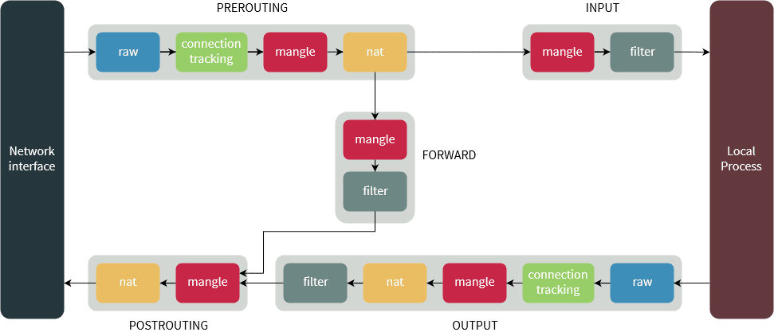

# netfilter

Netfilter：Linux操作系统核心层内部的一个数据包处理模块，它具有如下功能：

* 网络地址转换(Network Address Translate)

* 数据包内容修改

* 数据包过滤

Netfilter的配置表：存放设置的规则的文件，存放在内核内存中。iptables程序通过修改这个规则文件来控制网络数据包流动。
该配置表由表tables、链chains、规则rules组成。

***

### Netfilter配置表

#### 表(tables)

用于实现特定的功能

* raw表

  主要用于决定数据包是否被状态跟踪机制处理。在匹配数据包时，raw表的规则要优先于其他表。包含两条规则链 OUTPUT、PREROUTING。

  iptables中数据包和4种被跟踪连接的4种不同状态：

  * NEW：该包想要开始一个连接（重新连接或将连接重定向）
  * RELATED：该包是属于某个已经建立的连接所建立的新连接。
  * ESTABLISHED ：只要发送并接到应答，一个数据连接从NEW变为ESTABLISHED,而且该状态会继续匹配这个连接的后续数据包。	
  * INVALID：数据包不能被识别属于哪个连接或没有任何状态比如内存溢出，收到不知属于哪个连接的ICMP错误信息，一般应该DROP这个状态的任何数据。

* mangle表

  主要用于修改数据包的TOS（Type Of Service，服务类型）、TTL（Time To Live，生存周期）指以及为数据包设置Mark标记，以实现Qos(Quality Of Service，服务质量)调整以及策略路由等应用，由于需要相应的路由设备支持，因此应用并不广泛。包含五个规则链——PREROUTING，POSTROUTING，INPUT，OUTPUT，FORWARD。

* nat表

  主要用于修改数据包的IP地址、端口号等信息（网络地址转换，如SNAT、DNAT、MASQUERADE、REDIRECT）。属于一个流的包(因为包
  的大小限制导致数据可能会被分成多个数据包)只会经过这个表一次。如果第一个包被允许做NAT或Masqueraded，那么余下的包都会自动地被做相同的操作，也就是说，余下的包不会再通过这个表。

  表对应的内核模块为 iptable_nat，包含三个链：

  * PREROUTING链：作用是在包刚刚到达防火墙时改变它的目的地址
  * OUTPUT链：改变本地产生的包的目的地址
  * POSTROUTING链：在包就要离开防火墙之前改变其源地址

* filter表

  主要用于对数据包进行过滤，根据具体的规则决定是否放行该数据包（如DROP、ACCEPT、REJECT、LOG）。filter 表对应的内核模块为iptable_filter，包含三个规则链：

  * INPUT链：INPUT针对那些目的地是本地的包
  * FORWARD链：FORWARD过滤所有不是本地产生的并且目的地不是本地(即本机只是负责转发)的包
  * OUTPUT链：OUTPUT是用来过滤所有本地生成的包

#### 链(chains)

在处理各种数据包时，根据防火墙规则的不同介入时机，iptables供涉及5种默认规则链，从应用时间点的角度理解这些链：

* INPUT链：当接收到防火墙本机地址的数据包（入站）时，应用此链中的规则。

* OUTPUT链：当防火墙本机向外发送数据包（出站）时，应用此链中的规则。

* FORWARD链：当接收到需要通过防火墙发送给其他地址的数据包（转发）时，应用此链中的规则。

* PREROUTING链：在对数据包作路由选择之前，应用此链中的规则，如DNAT。

* POSTROUTING链：在对数据包作路由选择之后，应用此链中的规则，如SNAT。

#### 规则(rules)

* ACCEPT：允许数据包通过

* DROP：直接丢弃数据包，不给任何回应信息

* REJECT：拒绝数据包通过，必要时会给数据发送端一个响应的信息。

* SNAT：源地址转换。在进入路由层面的route之前，重新改写源地址，目标地址不变，并在本机建立NAT表项，当数据返回时，根据NAT表将
  目的地址数据改写为数据发送出去时候的源地址，并发送给主机。解决内网用户用同一个公网地址上网的问题。
  MASQUERADE，是SNAT的一种特殊形式，适用于像adsl这种临时会变的ip上

* DNAT:目标地址转换。和SNAT相反，IP包经过route之后、出本地的网络栈之前，重新修改目标地址，源地址不变，在本机建立NAT表项，当
  数据返回时，根据NAT表将源地址修改为数据发送过来时的目标地址，并发给远程主机。可以隐藏后端服务器的真实地址。
  REDIRECT：是DNAT的一种特殊形式，将网络包转发到本地host上（不管IP头部指定的目标地址是啥），方便在本机做端口转发。

* LOG：在/var/log/messages文件中记录日志信息，然后将数据包传递给下一条规则

除去最后一个LOG，前3条规则匹配数据包后，该数据包不会再往下继续匹配了，所以编写的规则顺序极其关键。

***

### 原理

***

***

从上图中，我们可以总结出以下规律：

1. 一个数据包进入网卡时，它首先进入PREROUTING链，内核根据数据包目的IP判断是否需要转发出去。

2. 如果数据包就是进入本机的，它就会沿着图向下移动，到达INPUT链。数据包到了INPUT链后，任何进程都会收到它。本机上运行的程序可以发送数据包，这些数据包会经 过OUTPUT链，然后到达POSTROUTING链输出。

3. 如果数据包是要转发出去的，且内核允许转发，数据包就会如图所示向右移动，经过 FORWARD链，然后到达POSTROUTING链输出。

***

